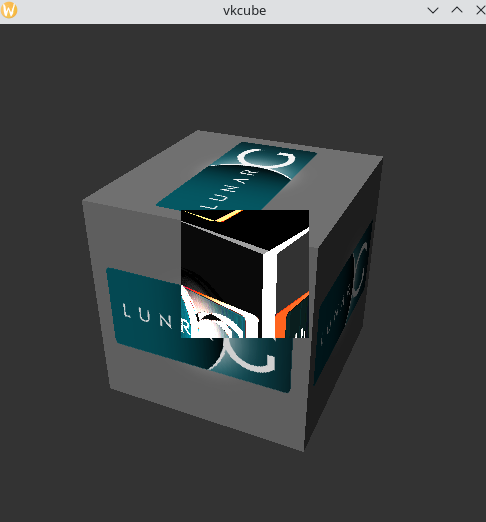

# Latency Measurement Layer

This layer attempts to accurately measure input latency without
the need to extra hardware that measures input event to photon latency.
It's vaguely similar to [AMD Frame Latency Meter](https://gpuopen.com/flm/),
except that it's designed to work on Linux.

## Primary use cases

This layer is intended to gather objective metrics for:

- Objectively validate Reflex/AntiLag latency reduction.
  These are notoriously annoying to get objective data for, and it's too easy to fall back to subjective analysis.
- Comparative analysis of streaming latency.
  For example, we can run the layer on the streaming client and verify roundtrip latency.
- Debug issues caused by excessive FIFO buffering.

## How it works

When the system is running, input events are generated synthetically.
This should trigger a response in the target application.
This represents ground truth felt latency by a user.
(We ignore display latency here, but that's out of our control as software developers.)

A small region of the application is captured in `vkQueuePresentKHR` by reading it back to the CPU
and analyzing when the output meaningfully changes from a stable state.
The layer assumes that the change in output was caused by the synthetic input.
To be more precise, the mean-square-error of images must be significantly greater
than the maximum mean-square-error of the previous N frames to be as close to 100% confident as possible.
For optimal results, camera should point at an image which lots of texture and edges.
Pointing at a flat image may lead to missed events since it's not easy to determine
if the image changed.

By default, a 128x128 region in the center of the screen is the capture window.
(TODO: Make this configurable if needed).
The center of the screen will show a debug view of the deltas between frames (with some delay due to implementation details).
When setting up a test scenario, this can be used to validate that the image is stable without input stimulus before captures are done.



Accurate metrics are obtained using `VK_EXT_present_timing`. For a present which we find to be significant,
we obtain feedback for when the GPU went idle, and when presentation was flipped on screen.
Based on this feedback, we can generate reports which cover:

- Latency of synthetic input to `QueuePresentKHR` being called. This represents CPU latency.
- Latency of application calling `QueuePresentKHR` to when GPU work for that present goes idle.
  This represents GPU processing latency which anti-lag/Reflex aims to mitigate.
  Ideally, this latency should be roughly equivalent to one frame's worth of processing time.
- Latency of GPU going idle and presentation flipping on-screen.
  On VRR where we're running below refresh rate, this delay should be virtually zero,
  but on fixed refresh rate displays, a large value here can pinpoint FIFO buffering latency.

## Enabling the layer

Once the layer is installed, `LATENCY_MEASUREMENT=1` is used to enable the layer.
To begin a capture sequence:

```
touch /tmp/latency-measurement-trigger
```

as long as this file exists, it will append events to a CSV file in `/tmp/`.
To stop a run, remove the trigger file. (This can be scripted obviously).

## Options for synthetic input

Currently, there are three primary ways to generate synthetic input.
This setup is quite primitive, but is trivial to expand as needed.

### Fake mouse movement (recommended)

In most PC games where latency is meaningful (first person),
mouse movement is expected to move the camera.

`LATENCY_MEASUREMENT_MOUSE=n` can be used as an environment variable to enable `n`
units of random mouse movements when attempting to trigger a frame difference.
Values around 10 seem to work well for me, but this is YMMV since it is
probably dependent on mouse acceleration, sensitivity etc in games.

### Fake gamepad input (default)

This is mostly relevant for pyrofling streaming latency analysis,
since pyrofling is designed for sending gamepad input at the moment.
The layer can automatically create a fake gamepad.
It is assumed that the right analog stick moves the camera.
Extending this system with a configurable stimulus is TODO.

#### Workaround for bad gamepad hotplug

Many games don't work properly when gamepads are connected late.
Since the Vulkan layer creates a gamepad on swapchain creation, it will
likely break some games. To workaround this, there is support for using `pyrofling` server
as a proxy for generating input events. E.g. start `pyrofling` server in a dummy mode.
It will not actually do any encoding since we're not connecting any video clients.

```
pyrofling --encoder pyrowave --bitrate-kbits 125000 --immediate-encode --low-latency --port 9000 --width 1280 --height 720
```

Then use environment variables `PYROFLING_IP=127.0.0.1 PYROFLING_PORT=9000` which will create a gamepad-only pyrofling client
for purposes of generating input stimulus (basically what `pyrofling-gamepad` does).

## Analyzing results

The results generated are plain CSV files that can be analyzed as desired.
Timestamps are in seconds. ID represents the `presentID` used which normally corresponds to
number of frames presented, but that's not necessarily the case.

```
id,stimulus,queuepresent,queuedone,Dequeued
8914,72.333532,72.358281,72.372870,72.373185
8948,72.795023,72.820125,72.832377,72.832935
...
```

See `analyze_run.py`.

E.g. `./analyze_run.py /tmp/latency-measurement-*.csv`:

```
======================
Analyzing /tmp/latency-measurement-wine64-preloader-2026-07-01-10-32-00.csv
Average frame time: 13.795 ms (72.488 Hz)

PresentComplete is determined by stage: Dequeued
        Dequeued: Used on Xwayland.
                Does not exactly represent when image is flipped on screen,
                but rather when compositor commits to displaying the image. A few milliseconds are expected.
        FirstPixelOut: Used on most compositors.
                Represents when GPU flips image on display controller.
        FirstPixelVisible: Represents when photons are actually emitted by display.
                Not supported by any known implementation.

Gap between input stimulus and PresentComplete:
  Represents overall felt latency
    Average 45.3 ms
      Standard Deviation +/- 4.6036 ms
    Median 46.3 ms
    Range [37.0, 52.5] ms

Gap between input stimulus and GPU idle:
  Represents overall felt latency under ideal VRR conditions
    Average 44.8 ms
      Standard Deviation +/- 4.5169 ms
    Median 45.9 ms
    Range [36.5, 51.9] ms

Gap between input stimulus and QueuePresent:
  If this is large, we are likely CPU bound or application is buffering input a lot
    Average 30.4 ms
      Standard Deviation +/- 4.3562 ms
    Median 31.2 ms
    Range [22.4, 37.9] ms

Gap between QueuePresent and GPU idle:
  If this is large, we are likely GPU bound and would benefit from anti-lag
    Average 14.4 ms
      Standard Deviation +/- 1.2281 ms
    Median 14.5 ms
    Range [12.2, 16.7] ms

Gap between GPU idle to PresentComplete:
  On VRR displays, this is ideally close to 0. If this is large, there is FIFO buffering
    Average 0.539 ms
      Standard Deviation +/- 0.22988 ms
    Median 0.498 ms
    Range [0.282, 1.14] ms
```

### Caveats

It's recommended to measure either on Wayland or native X11.
Xwayland's present timing implementation only supports `Dequeued`,
which doesn't directly represent when images are flipped on screen,
and it's possible that Xwayland may appear to have lower latency than Wayland.
NVIDIA does not support present timing on Xwayland at all.
The CSV contains information about which present stage is used for feedback to verify this.